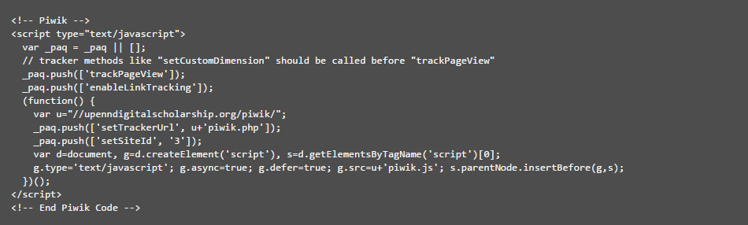

# Piwik Integration Instructions

* Sasha Renninger

For each site that requires integration:

1. Go to [http://upenndigitalscholarship.org/piwik/](http://upenndigitalscholarship.org/piwik/)

    1. Log in

    2. Click on "All Websites" in the upper right

    3. Click on "Add a new website" in the center right

    4. Edit the following fields:

        1. Name

            1. Use the name of the site on the home page

        2. URLs

            2. Copy and paste the url from the home page

        3. Time zone

            3. Change to "New York"

    5. Save

2. After you save, the new tracked website should appear in the list at the bottom of the page (you can also go to a list of all tracked websites by clicking "All Websites" in the upper right)

    6. Click "View Tracking Code" for the website tracker you just created

    7. Scroll down to the "Javascript Tracking Code" (it should look like this):

    8. Copy the entire thing, including comments (you will be using this several times, so please refer back to it every time the instructions say to "paste the Piwik Javascript Tracking Code")

3. **For Omeka sites:**

    9. Go to [https://portal.reclaimhosting.com/clientarea.php](https://portal.reclaimhosting.com/clientarea.php)

        4. Log in with your credentials

        5. Click on "cPanel" on the top of the screen

        6. On the next screen, click on "File Manager" at the top of the page

        7. You should now see a file list. Double click on "public_html" in the file list in the middle of the page

        8. Navigate to the folder containing all the Omeka code

        9. Double click on "themes"

        10. **For every folder in "themes":**

            4. Double click on the folder, then on "common"

            5. Right click "header.php" and then “Code Edit”

            6. Find the closing </head> tag

            7. Right **above** the </head> tag, paste the Piwik Javascript Tracking Code for this site

            8. **DO NOT FORGET TO CLICK "Save Changes" IN THE UPPER RIGHT**

4. **For WordPress sites:**

    10. Go to [https://portal.reclaimhosting.com/clientarea.php](https://portal.reclaimhosting.com/clientarea.php)

        11. Log in with your credentials

        12. Click on "cPanel" on the top of the screen

        13. On the next screen, click on "File Manager" at the top of the page

        14. You should now see a file list. Double click on "public_html" in the file list in the middle of the page

        15. Navigate to the folder containing all the WordPress code, then "wp-content", and then “themes”

        16. **For every folder in "themes":**

            9. Double click on the folder

            10. Right click "header.php" and then “Code Edit”

            11. Find the closing </head> tag

            12. Right **above** the </head> tag, paste the Piwik Javascript Tracking Code for this site

            13. **DO NOT FORGET TO CLICK "Save Changes" IN THE UPPER RIGHT**

5. **For Esri StoryMap sites:**

    11. Go to [https://portal.reclaimhosting.com/clientarea.php](https://portal.reclaimhosting.com/clientarea.php)

        17. Log in with your credentials

        18. Click on "cPanel" on the top of the screen

        19. On the next screen, click on "File Manager" at the top of the page

        20. You should now see a file list. Double click on "public_html" in the file list in the middle of the page

        21. Navigate to the folder containing all the StoryMap code

        22. Right click "index.html" and then “Code Edit”

        23. Find the closing </head> tag

        24. Right **above** the </head> tag, paste the Piwik Javascript Tracking Code for this site

        25. **DO NOT FORGET TO CLICK "Save Changes" IN THE UPPER RIGHT**

6. **For Weebly sites:**

    12. Go to [https://www.weebly.com/](https://www.weebly.com/)

        26. Log in

        27. Click "Edit Site" in the upper right

        28. Click on "Settings" at the top, and then “SEO” in the left menu

        29. Paste the Piwik Javascript Tracking Code for this site in the "Footer Code" box

        30. **DO NOT FORGET TO CLICK "Save" IN THE UPPER RIGHT**

7. After you have finished pasting in the tracking code, browse around to a couple of pages on the website and then go back to the Piwik dashboard to make sure it is recording your activity (To get to the dashboard for a site, click on "All websites" and then the name of the website you are working on)

8. If you can see your activity, you are done!!!!!!!!!! If you can’t, time to troubleshoot!

